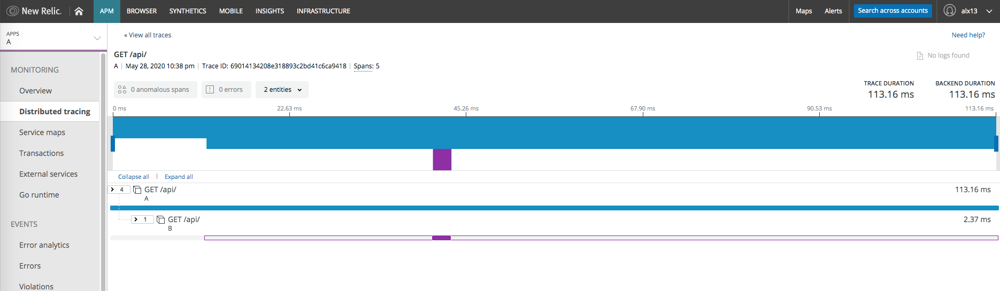

# istio-newrelic
Hacking istio to have proper distributed traces in NewRelic


## problem statement
If you are using [Istio](https://istio.io/) in your Kubernetes cluster
you probably want to achieve higher observability with Distibuted Tracing.

And if you are using NewRelic as the monitoring platform then you want
traces to be visible in [NewRelic Distributed Tracing](https://docs.newrelic.com/docs/understand-dependencies/distributed-tracing/get-started/introduction-distributed-tracing)

And when you add tracing with NewRelic agent to you application,
it will start sending data to NewRelic abount incoming requests
and adding [W3C](https://www.w3.org/TR/trace-context/) headers
to outgoing requests.

But there is one small problem — Istio of the box is not supporting W3C headers.

So in the end you will receive unconnected spans originated from
istio-proxy/envoy sidecars and gateways and NewRelic agent in your application.

## let's get our hands dirty
I'm using using Docker Desktop Kubernets cluster for testing.

Istio — v1.6.0.


Fist, let's install istio from a little bit modified, but still off-the-shelf
profile ([istio] directory):

```bash
cd istio
kubectl create namespace istio-system
./install-shelf.sh
```

Please check pods in `istio-system` namespace, they should be up and running.
```
$ kubectl -n istio-system get pods
NAME                                    READY   STATUS    RESTARTS   AGE
istio-ingressgateway-85cf5b655f-km6qk   1/1     Running   0          4m30s
istiod-7f494bfdc8-9vtxg                 1/1     Running   0          4m42s
```

With this profile there will be no zipkin/jaeger installed.

That's because you need to add some headers before sending data to NewRelic [trace api](https://docs.newrelic.com/docs/understand-dependencies/distributed-tracing/trace-api/report-zipkin-format-traces-trace-api):

```
 Api-Key: [API KEY HERE]
 Data-Format: zipkin
 Data-Format-Version: 2
```

### nr-tracing proxy
So we will just write a little go application that will act like a jaeger and proxy
data to NewRelic. Code is in [nr-tracing] directory.

It will read following environmental variables:

- PORT — port to listen, default 8080
- NEW_RELIC_API_KEY — Your [Insert API key](https://docs.newrelic.com/docs/insights/insights-data-sources/custom-data/send-custom-events-event-api#)
- NEW_RELIC_TRACE_URL — `https://trace-api.newrelic.com/trace/v1` if you are using US NewRelic data centers and `https://trace-api.eu.newrelic.com/trace/v1` in case of EU data centers

Next, build and push docker image for it. Please adjust script to your docker registry.


### nr-app
Let's build some simple web service and instrument it with NewRelic agent.
Code is in [nr-app] directory.

The service will listen to `GET /api/*` and:
- if no `UPSTREAM_URL` env variable configured — response with `[terminating upstream got <path>]` text/plain response
- if `UPSTREAM_URL` is set — send a `GET` request to upstream and response to client with upstream reqeust

Before calling upstream app will create a span (segment in terms of NewRelic Agent API):

```go
es := newrelic.StartExternalSegment(txn, req)
res, err := client.Do(req)
es.End()
```

Again, let's push this image to some docker registry.

### running in k8s
In [k8s] directory there are kubernetes and [kustomize](https://kustomize.io/) manifests.
```
gw.yaml         - istio ingress gateway configuration with "*" match
nr-app-a.yaml   — application with upstream configured to http://b.svc.cluster.local
nr-app-b.yaml   — application with no upstream
nr-tracing.yaml — nr-tracing proxy and "zipkin" service
ns-nr-app.yaml  — namespace nr-app
```

Please alter `image` fields in deployments to reflect your docker registry.

You will need to also create two `.env` files in k8s directory — one for `nr-app` and second for `nr-tracing`:

```env
# nr-app.env
NEW_RELIC_LICENSE_KEY=<your NewRelic license key>
```

```env
# nr-tracing.env
NEW_RELIC_API_KEY=<your Insert API key>
```

So, lets spin it up in our kubernetes cluster

```bash
kustomize build k8s | kubectl apply -f
```

Check the pods:
```
$ kubectl -n istio-system get pods
NAME                                    READY   STATUS        RESTARTS   AGE
istio-ingressgateway-85cf5b655f-km6qk   1/1     Running       0          33m
istiod-7f494bfdc8-9vtxg                 1/1     Running       0          33m
nr-tracing-74b74677f9-7v9jp             0/1     Running       0          10s

$ kubectl -n nr-app get pods
NAME                        READY   STATUS    RESTARTS   AGE
nr-app-a-7b47d854d5-z9rwg   2/2     Running   0          38s
nr-app-b-858db66f6d-x9mtd   2/2     Running   0          37s
```

Let's check envoy proxy configuration:
```
$ istioctl -n nr-app proxy-config bootstrap nr-app-a-7b47d854d5-z9rwg

...
  "clusters": [
    ...
      {
      "name": "zipkin",
      "type": "STRICT_DNS",
      "connectTimeout": "1s",
      "loadAssignment": {
          "clusterName": "zipkin",
          "endpoints": [
              {
                  "lbEndpoints": [
                      {
                          "endpoint": {
                              "address": {
                                  "socketAddress": {
                                      "address": "zipkin.istio-system",
                                      "portValue": 9411
                                  }
                              }
                          }
                      }
                  ]
              }
          ]
      },
  ]
  ...
  "tracing": {
      "http": {
          "name": "envoy.zipkin",
          "typedConfig": {
              "@type": "type.googleapis.com/envoy.config.trace.v2.ZipkinConfig",
              "collectorCluster": "zipkin",
              "collectorEndpoint": "/api/v2/spans",
              "traceId128bit": true,
              "sharedSpanContext": false,
              "collectorEndpointVersion": "HTTP_JSON"
          }
      }
  },
```

So, tracing should work now? Let's try:
```
curl localhost:80/api/
[terminating upstream got /api/]%
```



But we don't have istio-ingress here. What is actually happening now — we have 3 trace forests:


